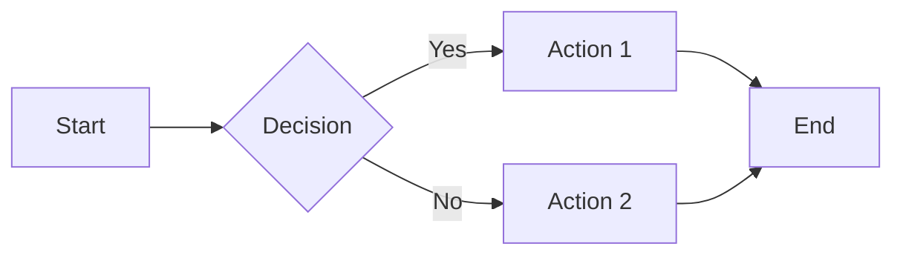
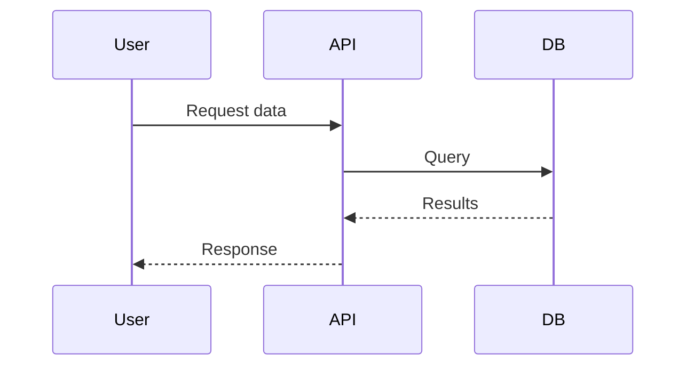

# Features

Explore the full range of features available in the Luminous Void theme.

---

## Code Blocks

### Syntax Highlighting

Support for 200+ languages with VS Code Dark+ theme:

```typescript title="example.ts"
interface User {
  id: number;
  name: string;
  email: string;
  roles: string[];
}

async function fetchUser(id: number): Promise<User> {
  const response = await fetch(`/api/users/${id}`);
  if (!response.ok) {
    throw new Error(`Failed to fetch user: ${response.status}`);
  }
  return response.json();
}
```

### Line Numbers & Highlighting

```python linenums="1" hl_lines="3-5"
def process_data(items: list) -> dict:
    results = {}
    for item in items:
        key = item.get('id')
        results[key] = transform(item)
    return results
```

### Annotations

```python
def hello(name: str) -> str:
    return f"Hello, {name}!"  # (1)!
```

1. This is an annotation! Hover or click to see it.

### Multiple Languages

=== "Python"

    ```python
    print("Hello, World!")
    ```

=== "JavaScript"

    ```javascript
    console.log("Hello, World!");
    ```

=== "Go"

    ```go
    fmt.Println("Hello, World!")
    ```

=== "Rust"

    ```rust
    println!("Hello, World!");
    ```

---

## Admonitions

### Standard Types

!!! note
    A note for additional information.

!!! tip
    A helpful tip for your users.

!!! info
    Important information to be aware of.

!!! warning
    A warning about potential issues.

!!! danger
    Critical warning - proceed with caution.

!!! success
    Great job! Something went well.

### Collapsible

??? note "Click to expand"
    This content is hidden by default but can be expanded.

???+ tip "Expanded by default"
    This content is shown by default but can be collapsed.

### Custom Titles

!!! example "Custom Example Title"
    Admonitions can have custom titles.

---

## Content Tabs

### Grouped Tabs

=== "macOS"

    ```bash
    brew install myapp
    ```

=== "Linux"

    ```bash
    apt install myapp
    ```

=== "Windows"

    ```powershell
    choco install myapp
    ```

### Linked Tabs

All tabs with the same labels stay synchronized across the page.

---

## Tables

### Basic Table

| Feature | Free | Pro | Enterprise |
|---------|:----:|:---:|:----------:|
| Users | 5 | 50 | Unlimited |
| Storage | 1 GB | 10 GB | 100 GB |
| Support | Community | Email | 24/7 |
| SSO | :material-close: | :material-check: | :material-check: |

### Sortable Data

| Language | Year | Creator |
|----------|------|---------|
| Python | 1991 | Guido van Rossum |
| JavaScript | 1995 | Brendan Eich |
| Go | 2009 | Robert Griesemer |
| Rust | 2010 | Graydon Hoare |

---

## Lists

### Task Lists

- [x] Install dependencies
- [x] Configure theme
- [ ] Write documentation
- [ ] Deploy to production

### Definition Lists

MkDocs
:   A fast, simple static site generator for building project documentation.

Material
:   A Material Design theme for MkDocs with many powerful features.

Luminous Void
:   A custom dark theme based on renner.dev design system.

---

## Diagrams

### Mermaid Support





---

## Keyboard Keys

Press ++ctrl+c++ to copy and ++ctrl+v++ to paste.

On macOS, use ++cmd+c++ and ++cmd+v++ instead.

---

## Emoji

Support for emoji using shortcodes:

- :material-rocket-launch: `:material-rocket-launch:`
- :material-check-circle: `:material-check-circle:`
- :material-alert: `:material-alert:`
- :fontawesome-brands-github: `:fontawesome-brands-github:`
- :octicons-heart-fill-24: `:octicons-heart-fill-24:`

---

## Buttons

[Primary Button](#){ .md-button .md-button--primary }
[Secondary Button](#){ .md-button }

---

## Footnotes

Here's a sentence with a footnote.[^1]

[^1]: This is the footnote content.

---

## Abbreviations

The HTML specification is maintained by the W3C.

*[HTML]: Hyper Text Markup Language
*[W3C]: World Wide Web Consortium

---

## Next Steps

- [Best Practices](best-practices.md) - Write effective documentation
- [API Reference](../api/index.md) - Explore the API docs
